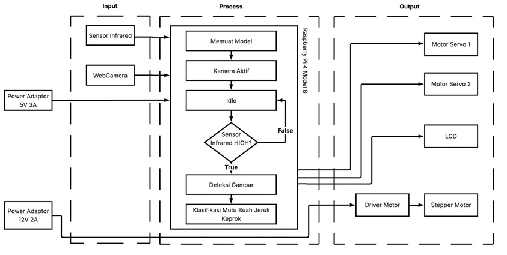
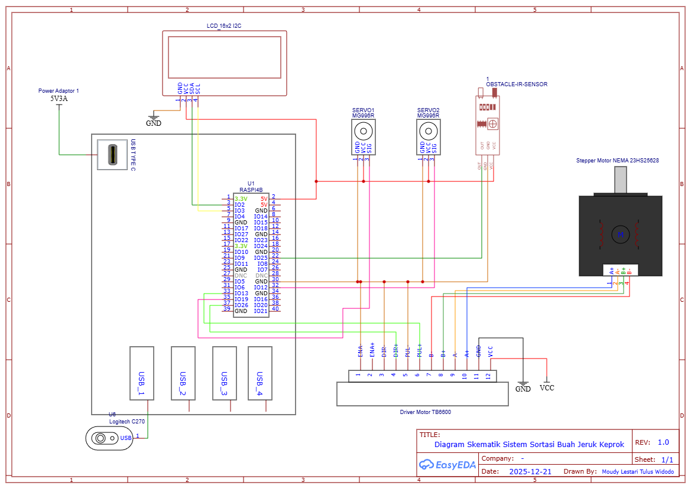
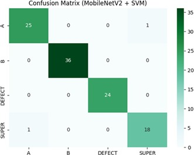
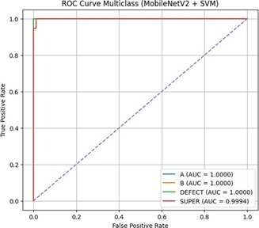
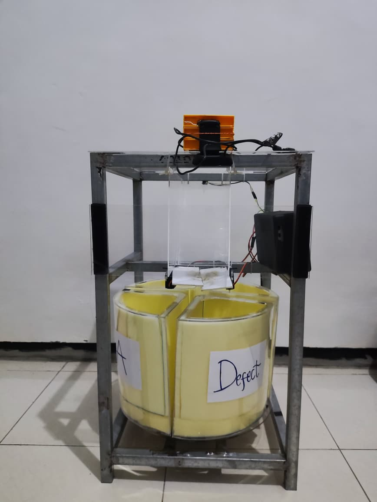
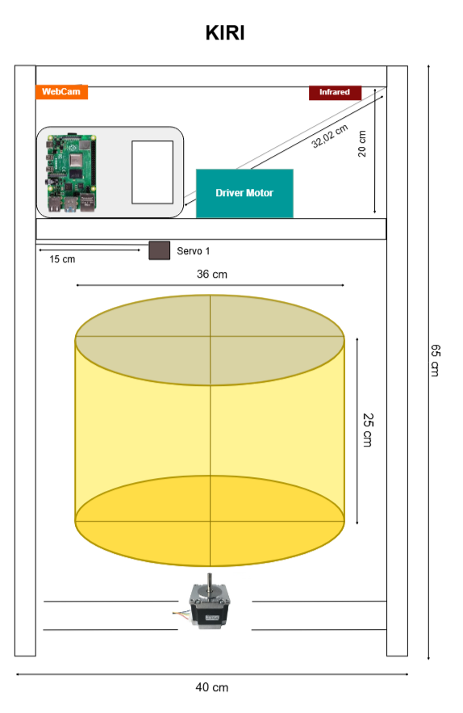

# AI-based Orange Quality Classification Using MobileNetV2 & SVM

Computer vision-based keprok orange quality classification system deployed on Raspberry Pi 4B, utilizing MobileNetV2 as a feature extractor and Support Vector Machine (SVM) for classification. The system is integrated with an automated sorting mechanism that separates oranges into different storage compartments based on their quality grade.

---

## Overview

Orange grading is traditionally performed manually, which can be time-consuming and inconsistent. This project aims to automate the quality assessment and sorting process of keprok oranges using computer vision and machine learning techniques.

The system captures orange images through a webcam, extracts visual features using MobileNetV2, classifies fruit quality using an SVM model, and automatically sorts the fruit using servo and stepper motors controlled by a Raspberry Pi 4B.

---

## Classification Classes

The model classifies oranges into four quality grades:

| Class | Description |
|---------|-------------|
| Grade Super | Premium-quality oranges |
| Grade A | High-quality oranges |
| Grade B | Standard-quality oranges |
| Grade Defect | Oranges with visible defects or imperfections |

---

## Features

- Real-time orange quality classification
- MobileNetV2 feature extraction
- SVM multi-class classification
- Raspberry Pi 4B deployment
- Webcam-based image acquisition
- Automated sorting mechanism
- Four-grade quality assessment

---

## Dataset

The dataset was collected independently and consists of images of keprok oranges captured under various conditions.

### Original Dataset

- Total Images: **1,051**
- Number of Classes: **4**
- Data Collection: Self-collected

### Data Augmentation

To improve model generalization and robustness, several augmentation techniques were applied:

- Horizontal Flip
- Vertical Flip
- Rotation between -15° and +15°
- Shear ±6° both horizontal and vertical
- Saturation Adjustment between -25% and +25%
- Brightness Adjustment between -25% and +25%
- Exposure Adjustment between -14% and +14%

### Dataset Split

| Dataset | Ratio |
|----------|----------|
| Training | 70% |
| Validation | 20% |
| Testing | 10% |

---

## Methodology

### 1. Feature Extraction

MobileNetV2 is utilized as a fixed feature extractor. Instead of performing end-to-end fine-tuning, image embeddings generated by MobileNetV2 are extracted and used as input features for the classifier.

### 2. Classification

A Support Vector Machine (SVM) model is trained using the extracted feature vectors to classify oranges into four quality grades.

### 3. Automated Sorting

After classification, the predicted grade is sent to the sorting mechanism:

- **Servo Motor** → Opens the corresponding trapdoor to release the orange into the correct compartment.
- **Stepper Motor** → Rotates the storage drum to align the appropriate compartment before sorting.

---

## System Workflow

### Block Diagram

### Schematic Diagram

---

## Hardware Components

- Raspberry Pi 4B
- Webcam Logitech C270
- Servo Motor MG996R
- Stepper Motor NEMA23HS5628
- Driver Motor TB6600
- Infrared Sensor
- LCD
- Power Supply

---

## Software Stack

- Python
- TensorFlow
- Scikit-learn
- NumPy
- Joblib
- RPi.GPIO

---

## Performance and Results

### Model Evaluation

| Metric | Score |
|----------|----------|
| Accuracy | 99.04% |
| Precision (Macro Avg.) | 97.72% |
| Recall (Macro Avg.) | 97.72% |
| F1-Score (Macro Avg.) | 97.72% |

### Confusion Matrix

### ROC Curve

### Deployment Performance

| Metric | Value |
|----------|----------|
| Deployment Accuracy | 92.5% |
| Average Inference Time | 0.42 Seconds |

### Prototype

  
  

## Future Improvements

- Enhance the hardware design and sorting mechanism for improved reliability and larger-scale operation.
- Upgrade the camera system to capture higher-quality images for better feature extraction.
- Expand and balance the dataset to improve model generalization and classification performance.
- Apply image segmentation or masking techniques to increase model focus on fruit characteristics.
- Adapt and retrain the system for other orange varieties and fruit classification applications.

---
